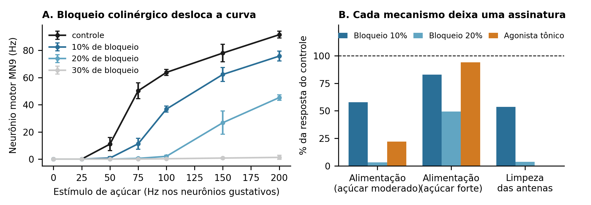

# SynapSting


Um gêmeo digital do cérebro da mosca-da-fruta para prever como o inseticida **imidacloprido** altera o
comportamento, e testar essas previsões em moscas reais. Projeto para a FEBRACE 2027.



## Resultados preliminares

- O simulador reproduz o modelo original do cérebro inteiro (Shiu et al., *Nature* 2024): correlação de 0,999 entre neurônios.
- Bloquear **10%** da transmissão colinérgica eleva o limiar do reflexo de alimentação de 74,5 para 105 Hz; **30%** abole a resposta.
- O bloqueio reduz a resposta máxima, e o agonismo tônico a preserva. A sacarose mais concentrada decide entre os dois mecanismos.
- A limpeza das antenas parece mais vulnerável que a alimentação. Com a fiação embaralhada, o circuito não responde.

Simulações com poucas tentativas; a rodada final (`configs/final.json`) será pré-registrada antes dos experimentos.

## Como rodar

```bash
pip install -e ".[dev]"
python scripts/baixar_dados.py --all
python -m synapsting.check && python -m pytest
```

Passo a passo completo, do zero: [docs/GUIA.md](docs/GUIA.md).

## Estrutura

| Pasta | O que tem |
| --- | --- |
| `synapsting/` | O modelo: conectoma, simulador, os dois mecanismos do inseticida e a análise das curvas |
| `scripts/` | Os comandos do projeto (tabela abaixo) |
| `configs/` | As grades de simulação (`teste.json`, `final.json`) e os dados de contato dos resumos |
| `testes/` | Testes automáticos, rodados pelo GitHub a cada envio |
| `resultados/` | Dados e figuras de cada rodada |
| `laboratorio/` | PER-bot (Arduino e vídeo) e estatística dos experimentos com moscas |
| `docs/` | Guia, pré-registro, diário e os resumos em PDF |

## Comandos

| Para | Comando |
| --- | --- |
| Baixar e conferir os dados do conectoma | `python scripts/baixar_dados.py --all` |
| Validar contra o modelo original | `python scripts/validar.py` |
| Rodar uma grade de simulações | `python scripts/rodar_grade.py configs/final.json --jobs 4` |
| Triagem de neurônios-gargalo | `python scripts/gargalos.py --top 40 --trials 10` |
| Ajustar curvas e gerar figuras | `python scripts/analisar.py resultados/final` |
| Gerar os resumos em PDF | `python scripts/resumos.py` |
| Criar tarefas e marcos no GitHub | `bash scripts/criar_tarefas.sh` |

## Créditos e transparência

Modelo e dados: Shiu et al. (2024), consórcio FlyWire (Dorkenwald et al. 2024; Schlegel et al. 2024; Eckstein et al. 2024).
A versão inicial do código foi escrita com assistência de IA (Claude); o aluno revisa, executa, valida e estende cada parte.
Licença MIT.
